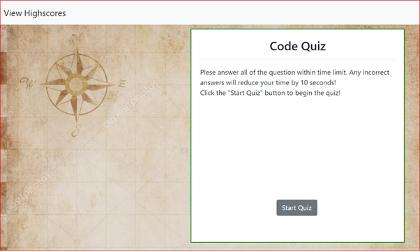
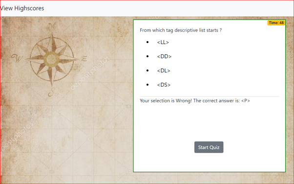
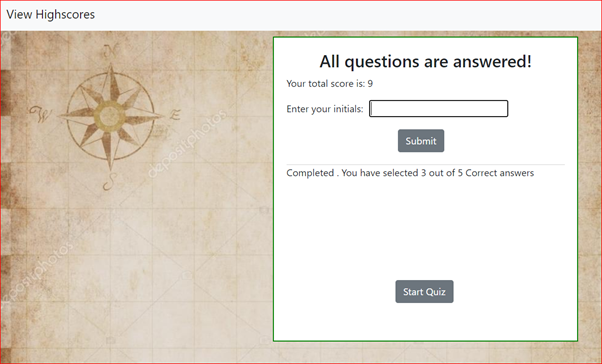
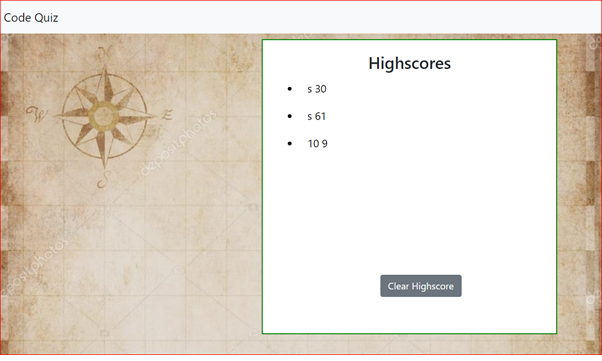

# codequiz
1. This is a timed quiz . The user should answer as many as many questions correctly and as quickly as possible.
2. If the user answers a question incorrectly, he/she will have 10 seconds deducted from the remaining time
3. The quiz will end once the user has either answered all the questions or has run out of time.
4. The user will also have the option to enter his/her initial into a textarea to be entered into local storage, along with their score.
5. The user can access their score page at the end of the quiz or before they begin a new one. This page also has the option to clear   all stored scores if they so choose from local storage.

# screenshot 
The following screenshot shows the behaviour of this applicaton
1. Starting page 
2. Progress 
3. Submitting 
4. Final Score 

